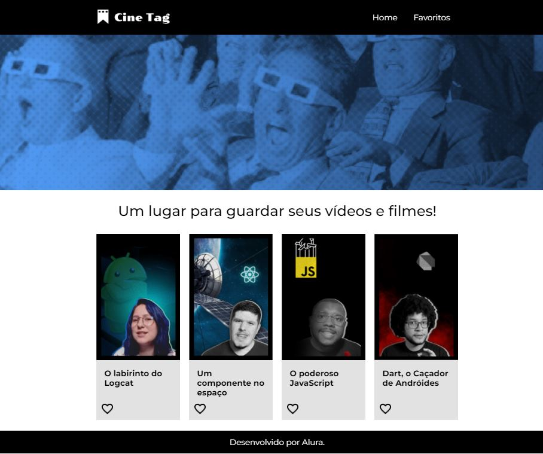

# CineTag



Bem-vindo ao **CineTag**! Este projeto foi criado com [React](https://reactjs.org/) e [Vite](https://vitejs.dev/), utilizando [Styled Components](https://styled-components.com/) para a estilização, [React Router](https://reactrouter.com/en/main) para navegação e uma configuração personalizada de ESLint.

## Funcionalidades

- **Vite**: Ferramenta de build rápida e otimizada para desenvolvimento front-end.
- **React**: Biblioteca para criação de interfaces de usuário.
- **React Router**: Navegação entre páginas de forma dinâmica e eficiente.
- **Styled Components**: CSS-in-JS para estilização dinâmica.
- **Hooks personalizados**: Como `useFavoritosContext`, para gerenciamento de favoritos.

## Pré-requisitos

- **Node.js** (Verifique se está instalado com `node -v`).
- **npm** ou **yarn** para gerenciar pacotes.

## Instalação

Siga os passos abaixo para rodar o projeto localmente:

1. Clone este repositório:

   ```bash
   git clone https://github.com/seu-usuario/cinetag.git
   ```

2. Navegue até o diretório do projeto:

   ```bash
   cd cinetag
   ```

3. Instale as dependências:

   ```bash
   npm install
   ```

4. Inicie o servidor de desenvolvimento:

   ```bash
   npm run dev
   ```

5. Abra o navegador e acesse `http://localhost:3000`.

## Scripts Disponíveis

- **`npm run dev`**: Inicia o servidor de desenvolvimento com Vite.
- **`npm run build`**: Compila o projeto para produção.
- **`npm run lint`**: Executa o ESLint para verificar o código.
- **`npm run preview`**: Visualiza a versão de produção localmente.

## Estrutura do Projeto

```bash
.
├── src
│   ├── components          # Componentes reutilizáveis (Card, Container, Rodape, etc.)
│   ├── hooks               # Hooks personalizados (useFavoritosContext)
│   ├── pages               # Páginas do projeto (Inicio, Player, PaginaBase)
│   ├── styles              # Estilos globais e de componentes
│   ├── App.jsx             # Componente principal
│   └── main.jsx            # Ponto de entrada do React
├── public                  # Arquivos estáticos
├── package.json            # Dependências e scripts do projeto
├── vite.config.js          # Configurações do Vite
└── README.md               # Este arquivo
```

## Tecnologias Utilizadas

- **React**: ^18.3.1
- **React DOM**: ^18.3.1
- **React Router DOM**: ^6.26.2
- **Styled Components**: ^6.1.13
- **Vite**: ^5.4.1

## Deploy

O projeto está disponível online via Vercel. Veja o projeto em funcionamento: [CineTag na Vercel](https://seu-projeto.vercel.app)

## Contribuição

Se você deseja contribuir com este projeto, fique à vontade para abrir issues ou pull requests. Sugestões e melhorias são bem-vindas!

## Licença

Este projeto está licenciado sob a MIT License. Veja o arquivo [LICENSE](./LICENSE) para mais detalhes.

---

Esse README foi adaptado para o projeto **CineTag** e a estrutura mostrada no `package.json`. Você pode adicionar a imagem de preview ao repositório e ajustar o caminho da imagem no README, conforme necessário.
